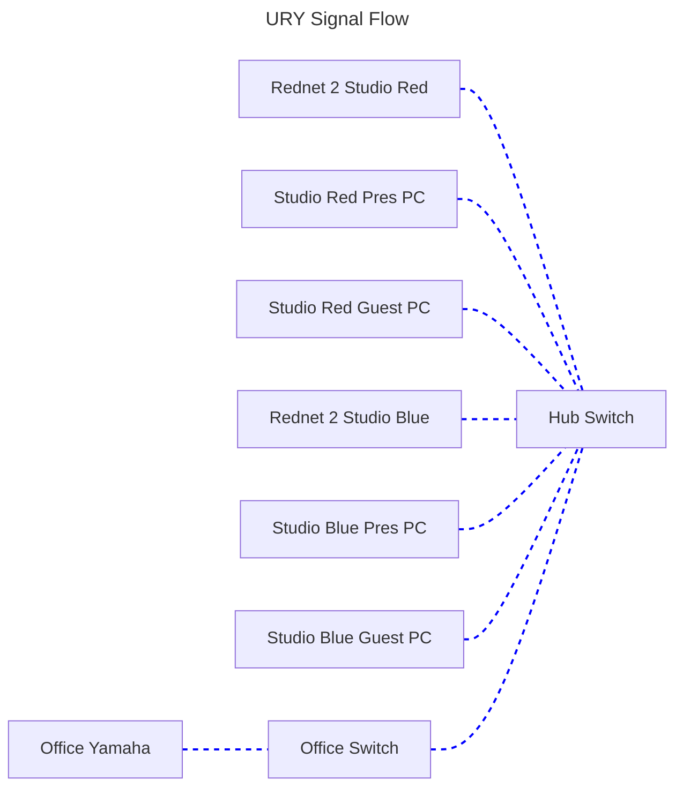

```mermaid
---
title: URY Signal Flow
---
graph LR
    A[Rednet 2 Studio Red] --- B[Hub Switch]
    C[Studio Red Pres PC] --- B
    D[Studio Red Guest PC] --- B
    E[Rednet 2 Studio Blue] --- B
    F[Studio Blue Pres PC] --- B
    G[Studio Blue Guest PC] --- B
    H[Office Switch] --- B
    I[Office Yamaha] --- H

    linkStyle 0 stroke:blue,stroke-width:2px,stroke-dasharray:5,5
    linkStyle 1 stroke:blue,stroke-width:2px,stroke-dasharray:5,5
    linkStyle 2 stroke:blue,stroke-width:2px,stroke-dasharray:5,5
    linkStyle 3 stroke:blue,stroke-width:2px,stroke-dasharray:5,5
    linkStyle 4 stroke:blue,stroke-width:2px,stroke-dasharray:5,5
    linkStyle 5 stroke:blue,stroke-width:2px,stroke-dasharray:5,5
    linkStyle 6 stroke:blue,stroke-width:2px,stroke-dasharray:5,5
    linkStyle 7 stroke:blue,stroke-width:2px,stroke-dasharray:5,5
```
